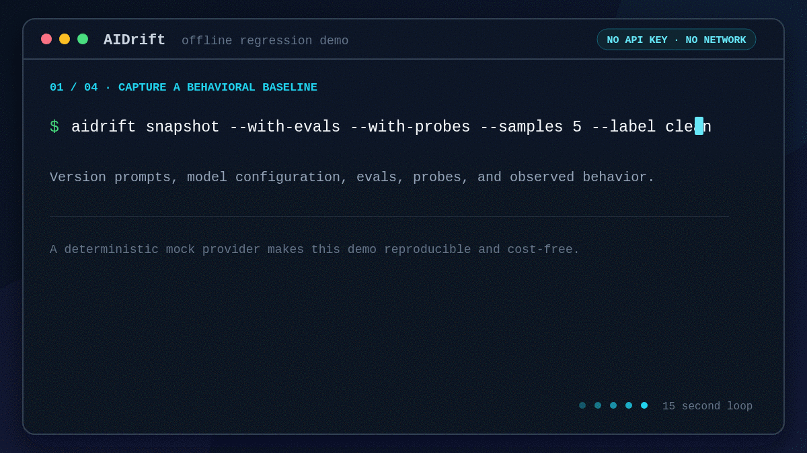

# AIDrift by ZettaCore

AIDrift is a local-first, Git-native CLI for versioning, diffing, testing, and gating the behavioral state of AI systems. It is an open-source project from [ZettaCore](https://zettacorelabs.com).

One-line pitch: Terraform for AI behavior.

AIDrift treats prompts, model settings, eval expectations, provider probes, and observed outputs as versioned behavioral state. It gives teams a reproducible baseline and a CI gate for detecting statistically supported regressions instead of relying on ad hoc prompt checks.



The animation uses AIDrift's deterministic mock provider: no API key, network request, or provider cost. [Run the complete offline regression example](examples/quickstart/README.md).

## Current Status

`0.9.0-beta.1` is the first public beta. The CLI packages are distributed through npm's `next` channel, and the GitHub Action is available from the matching immutable release tag. The following commands are available:

| Command            | Description                                                  |
| ------------------ | ------------------------------------------------------------ |
| `aidrift init`     | Scaffold `.aistate.yml` for an existing AI project           |
| `aidrift validate` | Parse and validate `.aistate.yml`                            |
| `aidrift snapshot` | Capture declared artifacts and optional behavioral baselines |
| `aidrift history`  | List all local snapshots                                     |
| `aidrift diff`     | Compare current state or two snapshots                       |
| `aidrift plan`     | Execute the declared AI target and compare sampled behavior  |
| `aidrift probe`    | Run provider-drift probes                                    |
| `aidrift check`    | Run the non-interactive CI regression gate                   |

## Five-Minute Offline Quickstart

This flow goes from an empty directory to a behavioral baseline and first check without an API key or YAML editing:

```bash
npm install --global @zettacore/aidrift@next
mkdir aidrift-demo
cd aidrift-demo
aidrift init --yes
aidrift validate
aidrift snapshot --with-evals --with-probes --samples 5 --label baseline
aidrift plan --samples 5
aidrift check --samples 5
```

`init` creates a mock model, an explicit eval target, and a starter assertion. The deterministic mock provider performs no network calls and incurs no provider cost. The final command exits `0`; configuration/runtime failures exit `2`.

To see an intentional change produce statistically supported exit `1`, run the complete versioned [offline regression example](examples/quickstart/README.md). The release gate executes that example from freshly packed and installed npm tarballs. Replace the starter smoke assertion with domain-specific behavior before using AIDRIFT as a production gate.

`plan` supports provider targets backed by the deterministic mock executor, OpenAI Chat Completions, or Anthropic Messages. Credentials are read only from environment variables. Declared text prompts and supported model parameters are applied to requests; manifests that declare RAG, tools, safety rules, or adapters are rejected for behavioral execution until a target can apply them.

The supported assertion types are `contains`, `regex`, and `json_schema`. The unavailable types `llm_judge`, `tool_call`, `latency`, `cost`, `semantic_stability`, and `custom` are rejected explicitly; they are not implemented in the current release.

Regex assertions are screened for unsafe backtracking. Regular expressions inside JSON Schema assertions use RE2 syntax, so lookaround and backreferences are not supported. See the [runtime safety and resource limits](docs/reference/safety-limits.md) for the complete bounded-execution contract.

Every behavioral run requires an explicit `eval.target`:

```yaml
eval:
  suite: ./evals
  samples_per_assertion: 5
  significance_level: 0.05
  timeout_seconds: 30
  target:
    type: provider
    model: primary
    prompts: [system]
```

## Provider Drift Evidence

`aidrift probe` ships 20 canonical probes across deterministic, structural, semantic, behavioral, and performance categories. Comparisons use all baseline/current samples and report one of `PASS`, `WARN`, `DRIFT`, `INSUFFICIENT`, `ERROR`, or `NEW` with Fisher exact or Welch t-test evidence where a baseline exists.

```bash
aidrift probe --model primary --category semantic --samples 5
aidrift probe --provider openai --estimate-cost
aidrift probe --provider openai --cost-budget 0.05
```

OpenAI and Anthropic are the supported live adapters; other providers fail closed. Estimates are request/token based. Unknown model prices remain unknown and cannot pass a dollar budget implicitly.

## CI Gate

`aidrift check` is non-interactive and returns `0` for a passing gate, `1` for a regression, and `2` for configuration/runtime failure. It compares current artifact state for context and gates on sampled behavioral evidence. Artifact changes are informational because an intentional source change is not itself a behavioral regression.

```bash
aidrift check --format github --fail-on warn
aidrift check --format json --output .aidrift/check.json
aidrift check --samples 5 --probe-category behavioral --timeout 120
aidrift check --cost-budget 0.25 # mandatory for live-provider checks
```

JSON output conforms to `packages/sdk/schemas/check-output.v3.json`; the packaged v1 and v2 schemas remain available for older consumers. CI controls include assertion/tag filters, probe model/category filters, sample count, concurrency, a total timeout, and an enforceable live-provider cost ceiling.

## GitHub Action

The Node 24 Action under `packages/action` bundles the exact CLI and runs `check` once. It emits workflow annotations, uploads JSON and JUnit evidence, exposes result outputs, and can upsert one bot-owned PR comment.

Pin the Action to the immutable beta release tag:

```yaml
permissions:
  contents: read
  pull-requests: write

steps:
  - uses: actions/checkout@3d3c42e5aac5ba805825da76410c181273ba90b1 # v7.0.1
  - uses: Parth2412/aidrift/packages/action@v0.9.0-beta.1
    with:
      samples: "5"
      timeout: "120"
      comment-mode: upsert
      github-token: ${{ github.token }}
```

Use `pull_request`, not `pull_request_target`. Fork comments are skipped, and live-provider checks require both an environment-only credential and an explicit `cost-budget`. See `packages/action/README.md` for the complete input, output, and security contract.

## Generated References

- [CLI commands and options](docs/reference/cli.md)
- [Manifest v1 properties](docs/reference/manifest.md)
- [Manifest v1 JSON Schema](packages/sdk/schemas/aistate.v1.schema.json)
- [Check output v3 JSON Schema](packages/sdk/schemas/check-output.v3.json)
- [Runtime safety and resource limits](docs/reference/safety-limits.md)

Run `pnpm docs:generate` after CLI or manifest-schema changes. CI and release validation run `pnpm docs:check` and reject stale generated artifacts.

Beta limitations and feedback instructions are tracked in [BETA.md](BETA.md).

## Packages

| Package                   | Purpose                                                         |
| ------------------------- | --------------------------------------------------------------- |
| `@zettacore/aidrift`      | Public CLI and the `aidrift` executable                         |
| `@zettacore/aidrift-core` | Manifest, snapshot, eval, probe, and provider runtime engines   |
| `@zettacore/aidrift-sdk`  | Versioned TypeScript contracts and packaged JSON Schemas        |
| `packages/action`         | Repository-distributed GitHub Action; not published through npm |

All public npm packages use one coordinated version. Pin an exact prerelease version until AIDrift reaches a stable release.

## Security And Privacy

AIDrift is local-first and has no telemetry or hosted service. Provider credentials are read from environment variables and redacted from normal error output. Snapshot state stays in the project unless a user deliberately commits it or uploads CI evidence.

Report vulnerabilities privately as described in [SECURITY.md](SECURITY.md). Do not include credentials, proprietary prompts, model output, or customer data in public issues.

## Contributing

See [CONTRIBUTING.md](CONTRIBUTING.md) and the [Code of Conduct](CODE_OF_CONDUCT.md). Development happens on `development`; `main` contains promoted release history.

## License

Apache License 2.0. See [LICENSE](LICENSE).

## Local Setup

Use Node 24.20.0 (the pinned LTS release) and pnpm 10.28.2 for repository development. Published packages declare Node 22.14.0 or newer.

```bash
pnpm install
pnpm lint
pnpm typecheck
pnpm test
pnpm test:coverage
pnpm audit:dependencies
pnpm audit:licenses
pnpm build
pnpm release:check
pnpm test:packed
```
